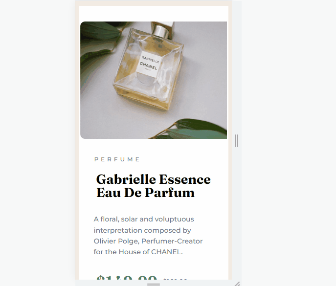

# Frontend Mentor - componente de cartao produto perfume

## Descrição:
    Bem-vindo! 👋
    Obrigado por conferir a minha resolução do desafio iniciante do Frontend Mentor, pois este é o meu segundo desafio. 
    

## Dificuldades:
 Geral: Nesse desafio básico tive dificuldades nos tamanhos, e o posicionamento de cada parte.
 Medições: Não possuo tanto experiência com os tamanhos em EM então testei pra ver como fica, dái tive um pouco de dificuldade nessa parte.

## Técnologias Utilizadas:
    HTML 5
    CSS 3
    Flex
